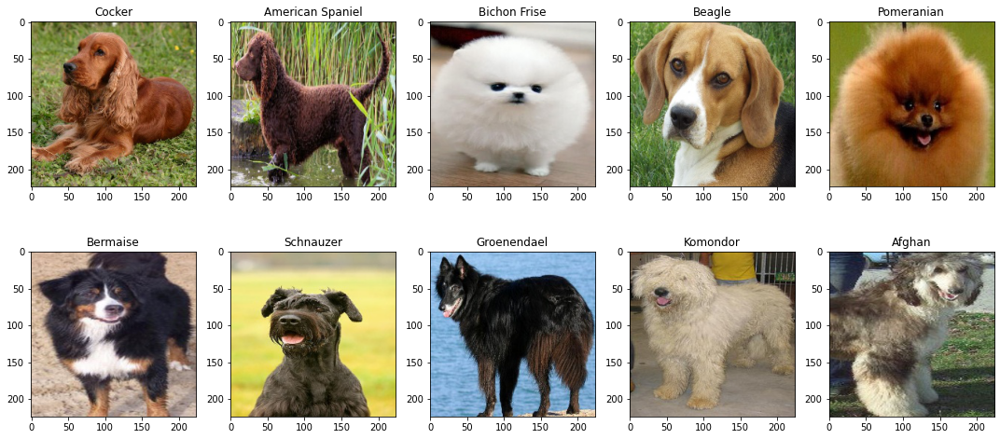

# Dog Breed Classification

## AIM
To classify 70 different dog breeds using deep learning models including MobileNetV2, Vgg19, and ResNet50V2.

## DATASET LINK
[70 Dog Breeds Image Dataset](https://www.kaggle.com/datasets/gpiosenka/70-dog-breedsimage-data-set)

## MY NOTEBOOK LINK
Notebook is located in the model directory.

## DESCRIPTION
The primary objective of this project is to accurately classify dog breeds from images using advanced deep learning techniques. By leveraging state-of-the-art convolutional neural network (CNN) architectures, including ResNet50V2, MobileNetV2, and VGG19, I aim to develop a model capable of predicting the correct breed label for each input image.

### What is the requirement of the project?
This project addresses the need for efficient dog breed classification in various applications, such as pet identification, veterinary diagnostics, and organizing breed-specific data for shelters or adoption centers.

### Why is it necessary?
Dog breed identification is crucial for medical care, understanding behavior, and ensuring proper treatment and housing for different breeds. Automating this task with a reliable model can significantly reduce human effort, improve accuracy, and provide instant results.

### How is it beneficial and used?
This model can assist in pet adoption, veterinary diagnostics, and creating apps where users upload photos to identify dog breeds. It is particularly useful in dog shows, pet insurance, or when registering pets.

### How did you start approaching this project?
The project began with thorough exploration of the dataset to understand the variety of breeds and image distribution. After pre-processing the images (e.g., resizing ,normalization and augmentation), multiple deep learning architectures (MobileNetV2, Vgg19, and ResNet50V2) were trained and evaluated for their classification accuracy.

## EXPLANATION

### DETAILS OF THE DIFFERENT FEATURES
The key features of the project include:
- **Data Preprocessing**: Images were resized, normalized, and split into training, validation, and testing sets.
- **Model Selection**: Three different deep learning architectures (MobileNetV2, Vgg19, and ResNet50V2) were trained.
- **Evaluation Metrics**: The models were evaluated based on their classification accuracy on the validation and test sets.

### WHAT I HAVE DONE
1. Initial data exploration and understanding.
2. Data cleaning and preprocessing, including resizing images and normalizing pixel values.
3. Split the dataset into training, validation, and test sets.
4. Trained three models (MobileNetV2, Vgg19, and ResNet50V2) on the dataset.
5. Evaluated the performance of each model based on accuracy.

### LIBRARIES NEEDED
- pandas
- numpy
- matplotlib
- tensorflow
- keras

### SCREENSHOTS
- **Project Structure**: The model directory contains the notebook and trained models.
- 

### MODELS USED AND THEIR ACCURACIES
| Model       | Accuracy 
|-------------|----------
| MobileNetV2 | 96.28%   
| Vgg19       | 91.85%   
| ResNet50V2  | 96.28%   

## CONCLUSION

### WHAT YOU HAVE LEARNED
- The MobileNetV2 and ResNet50V2 models performed exceptionally well with over 96% accuracy, making them reliable for real-world applications.
- Vgg19, while slightly less accurate, still achieved impressive results with 91.85% accuracy.
- Improved understanding of deep learning architectures and their performance in image classification tasks.
- Overcame challenges related to large-scale image processing.

### USE CASES OF THIS MODEL
1. **Pet Adoption Platforms**: This model can help pet adoption centers identify and display dog breeds more accurately on their websites.
2. **Veterinary Diagnostics**: Used by veterinarians to assist in breed-specific medical diagnosis and treatment planning.

### HOW TO INTEGRATE THIS MODEL IN REAL WORLD
1. Prepare the data pipeline by connecting the model to a real-time image processing system.
2. Deploy the model using frameworks such as Flask or FastAPI for web integration.
3. Monitor the model’s performance in production and update it with new data as needed.

### My Signature

*Vivek Prakash*

[Linkedin](https://www.linkedin.com/in/vivek-prakash-b46830283/)
